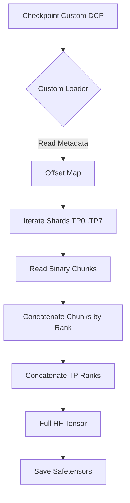
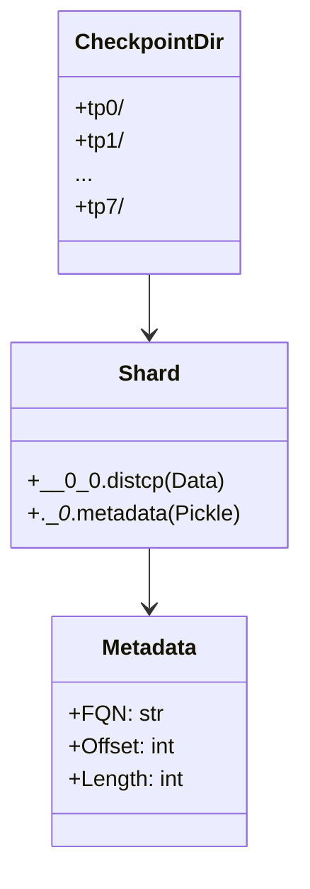

# Final Report: Llama 3 70B Checkpoint Conversion (Custom DCP) to Hugging Face

## 1. Introduction
The objective of this project was to convert a PyTorch distributed training checkpoint (DCP) with a proprietary/custom format into a standard Hugging Face format (`safetensors`), to enable inference and evaluation using standard tools.

The model is a **Llama 3 70B** variant (FP8), trained with Tensor Parallelism (TP=8).

## 2. Technical Challenges and Detailed Solutions

### 2.1. Reverse Engineering the Metadata Format (Custom Pickles)
The first obstacle was that the `.__{id}_.metadata` files were not standard Python dictionaries, but serialized objects of proprietary classes unavailable in our environment.
- **Original Error**: `ModuleNotFoundError: No module named 'torch.distributed.checkpoint.metadata'` (or similar, pointing to custom classes).
- **Analysis**: When attempting to load with `pickle`, the deserializer looked for class definitions such as `MetadataIndex`, `_StoragePrefix`, `ChunkStorageMetadata`.
- **Technical Solution**: We implemented a `CustomUnpickler` that intercepts the class lookup (`find_class`). Instead of failing, it returns "Mock" classes that simply store attributes in a dictionary (`self.__dict__`).
    ```python
    class CustomUnpickler(pickle.Unpickler):
        def find_class(self, module, name):
            if name == 'MetadataIndex': return MetadataIndex # Mock class
            return super().find_class(module, name)
    ```
    This allowed us to read the checkpoint structure (offsets, lengths, names) without having the original training source code.

### 2.2. Extracting Tensors from Concatenated Files (`.distcp`)
Unlike Hugging Face (`model.safetensors`) or standard PyTorch (`pytorch_model.bin`) checkpoints, this format groups multiple tensors into container files (`.distcp`).
- **Format**: The `.distcp` files are flat binaries containing multiple data streams serialized by `torch.save`.
- **Reading Mechanism**: The metadata provides an `offset` (start byte) and a `length` (byte count) for each tensor.
- **Implementation**:
    1. Open the file in binary mode (`rb`).
    2. Position the cursor using `f.seek(offset)`.
    3. Read the exact bytes: `data = f.read(length)`.
    4. Wrap the bytes in an `io.BytesIO(data)`.
    5. Use `torch.load(buffer)` to deserialize the individual tensor from memory.

### 2.3. Weight Fragmentation (Chunks) and Reconstruction Logic
We discovered that large tensors were not saved as a single piece per rank, but divided into multiple small "chunks" distributed across several files.

#### File Structure Observation
Upon inspecting folders like `tp0_ep0`, we found a sequence of binary and metadata files:
- `__0_0.distcp`, `__1_0.distcp`, ..., `__13_0.distcp` (Data files).
- `.__0_.metadata`, `.__1_.metadata`, ..., `.__13_.metadata` (Index files).

This indicated that the checkpoint was saved by splitting data into **14 physical chunks** for each Tensor Parallelism rank.

#### The "Small Weights" Problem
Initially, when loading a tensor, we obtained strange shapes (e.g., `[92, 8192]` instead of `[1024, 8192]`). This happened because we were reading only the first chunk found for that tensor. A large tensor (like `q_proj`) was spread across multiple `.distcp` files.

#### Implemented Solution (The "Loop of 20")
To reconstruct the full tensors, the script implements the following logic:
1.  **Heuristic Iteration**: Iterate from `chunk_idx = 0` to `19` (a total of 20).
    * *Note*: Although we observed 14 files, we defined a limit of 20 as a safety margin to ensure no data is lost if other ranks have more fragments.
2.  **FQN Search**: In each chunk, check if an entry exists for the desired tensor name (FQN).
3.  **Concatenation**: All found fragments are loaded and concatenated along dimension 0 (rows) to form the rank's full tensor.

```python
# Simplified script logic
rank_chunks = {}
for chunk_idx in range(20): # Safety margin > 14
    if exists(chunk):
        tensor_part = load_chunk(chunk_idx, fqn)
        rank_chunks[chunk_idx] = tensor_part
full_tensor = torch.cat(rank_chunks.values(), dim=0)
```

### 2.4. Layer Name Inconsistencies (Key Mismatches)
The mapping between the training checkpoint names and Llama 3 in Hugging Face was not direct, and some names changed arbitrarily.
- **Critical Case: Final Norm**: The script expected `state_dict.transformer.final_layernorm.weight`. However, the checkpoint used `state_dict.layernorm.weight` in some contexts or versions.
    - *Solution*: We implemented "fallback" logic. If the primary key is not found, the script automatically tries alternative keys.
- **LM Head Case**: Similarly, the output layer appeared sometimes as `output_layer` and other times as `lm_head`.
- **General Mapping**:
    - `seq_layers.{i}.layer.self_attention.layernorm_qkv` -> `input_layernorm` + `q_proj/k_proj/v_proj`.
    - `seq_layers.{i}.layer.layernorm_mlp` -> `post_attention_layernorm` + `gate_up_proj`.

### 2.5. Ambiguity in Weight Structure (RoPE and MLP)
Once the tensors were loaded, their numerical shapes didn't tell us how to interpret the internal data.
- **Rotary Embeddings (RoPE)**:
    - *Question*: Do the `q` and `k` weights already have the complex permutation required for RoPE applied (original Meta format), or are they "un-permuted" (Hugging Face format)?
    - *Experiment*: We generated versions with and without permutation. The version without permutation (`rope_perm=False`) worked, indicating the checkpoint was already in a compatible or "clean" format.
- **MLP SwiGLU (Gate vs Up)**:
    - *Question*: The `fc1` layer contained two fused projections. Was the order `[Gate, Up]` or `[Up, Gate]`?
    - *Experiment*: We tested both slices. The `gate_up` configuration (first half Gate, second half Up) proved correct for generating coherent text.

## 3. Solution Architecture

### Conversion Flowchart



### Original Checkpoint Structure



## 4. Final Script (`convert_llama3_final.py`)

The final script encapsulates all necessary logic:
1.  **Pickle Mocking**: Allows reading metadata without external dependencies.
2.  **Tensor Reconstruction**: Handles offset and chunk logic automatically.
3.  **Name Mapping**: Converts training layer names (e.g., `seq_layers.0.layer`) to Hugging Face (`model.layers.0`).
4.  **Validated Configuration**:
    * `rope_perm = False` (Weights are already HF compatible).
    * `mlp_order = "gate_up"` (Standard Llama 3 order).

### Usage

```bash
python convert_llama3_final.py \
    --input_path /path/to/checkpoint \
    --output_path /destination/path
```

## 5. Validation
The model was validated by loading it into `transformers` and generating text.
- **Prompt**: "The capital of Chile is"
- **Output**: "Santiago" (Correct).

The resulting model is fully compatible with the Hugging Face ecosystem (`transformers`, `accelerate`, `vllm`).